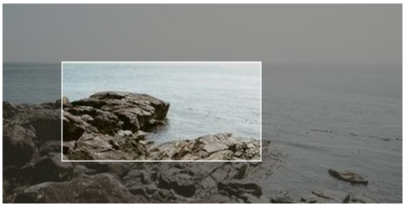
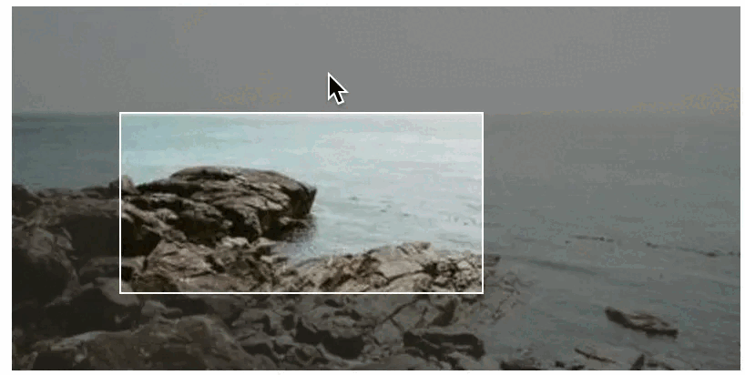
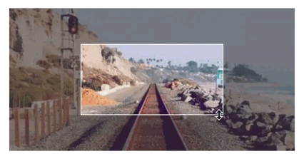

# SelectBox User Interface for Web Pages (SelectBoxUI)

This library provides a user interface to make a visual selection of a rectangular area in an element of a Web page. The effect is shown in the following image:



Then the user can move the selection, resize it, and get the coordinates of the selection as in the next animation:



To get this effect, you just need to add the `selectbox-ui.js` script and `selectbox-ui.css` style sheet to your Web page and add the `data-selectboxui` attribute to the element you want to add the effect to. For example:

```html
<script src="selectbox-ui.js"></script>
<link href="selectbox-ui.css" rel="stylesheet"/>
...
<div data-selectboxui>
    
</div>
```

Alternatively, you can either use the `selectBoxUI` function (which will be defined in the window upon including the library) or use the _jQuery_ call `$('img').selectBoxUI()` to add the effect to the element.

The library is written in JavaScript and it is compatible with [jQuery](https://jquery.com/) (although it is not needed). It is distributed under the [MIT License](https://opensource.org/licenses/MIT).

## Usage

To use the library, you just need to include the `selectbox-ui.js` file in your Web page. You can download it from the [GitHub repository](https://github.com/dealfonso/selectbox-ui) or get it from the CDN:

```html
<script src="https://cdn.jsdelivr.net/gh/dealfonso/selectbox-ui@1.0/dist/selectbox-ui.min.js"></script>
<link href="https://cdn.jsdelivr.net/gh/dealfonso/selectbox-ui@1.0/dist/selectbox-ui.min.css>" rel="stylesheet"/>
```

### Declarative HTML Version

The declarative version is the easiest way to use the library. You just need to add the `data-selectboxui` attribute to the element you want to add the effect to. For example:

```html

```

It is also possible to customize the effect by adding the `data-selectboxui-*` attributes to the element. For example:

```html

```

The available options are described in the [Options](#options) section.

### Using in Javascript

You can use the global `selectBoxUI` function to add the effect to an element. The function accepts two parameters:

- `element`: Element to add the effect to. It can be a DOM element e.g. obtained using `document.querySelector("div")`.
- `options`: Object with the options to customize the effect. The available options are described in the [Options](#options) section.

Once an element has the effect, it will have a `selectBoxUI` property which is an object that enables to control the effect. An example of usage is the following:

```javascript
var element = document.querySelector("div");
element.selectBoxUI.set("10% 20% 30% 40%");
element.selectBoxUI.disable();
```

The available commands are:

- `enable`: Enables the visual elements of the select box (i.e. if they are over any part of the underlying components, they will have priority over them and the user interaction will not reach to these underlying components).
- `disable`: Disables the visual elements of the select box (i.e. even if they are over any part of the underlying components, they will not have priority over them and the user interaction will reach to these underlying components)
- `show`: Shows the visual elements of the select box.
- `hide`: Hides the visual elements of the select box.
- `set`: Sets the selection box to a new position. The parameter is a string with any of the accepted formats `left top right bottom`, `horizontal vertical` or `size` (see [Selection Box format](#selection-box-format)).
- `get`: Gets the selection box position. The result is an object with the properties `left`, `top`, `right` and `bottom`.

### Using in jQuery

If you are using [jQuery](https://jquery.com/), you can use the `selectBoxUI` function to add the effect to an element, and to interact with the element that has the effect. E.g.: 

```javascript
$('div').selectBoxUI({initialBox: "10% 20% 30% 40%"});
$('div').selectBoxUI("enable");
```

When adding the effect to an element, the function accepts one parameter which is an object with the options to customize the effect. The available options are described in the [Options](#options) section.

Once an element has the effect, the jQuery `selectBoxUI` plugin enables the following commands: `enable`, `disable`, `show`, `hide`, `set` and `get`. The commands are the same as in the [Using in Javascript](#using-in-javascript) section, and are used passing the command as a string to the `selectBoxUI` function. E.g.:

```javascript
$('div').selectBoxUI("enable");
```

In the case of the `set` command, the parameter is a string with any of the accepted formats `left top right bottom`, `horizontal vertical` or `size` (see [Selection Box format](#selection-box-format)). E.g.:

```javascript
$('div').selectBoxUI("set", "10% 20% 30% 40%");
```

## Selection Box

The selection box is the area that is selected by the user. It is defined by the top-left and bottom-right corners. The selection box is defined by the following properties:

- `left`: Distance from the left side of the element to the left side of the selection box.
- `top`: Distance from the top side of the element to the top side of the selection box.
- `right`: Distance from the right side of the element to the right side of the selection box.
- `bottom`: Distance from the bottom side of the element to the bottom side of the selection box.
- `width`: Width of the element.
- `height`: Height of the element.

The selection box can be set using the `set` command or the `initialBox` option. The selection box can be retrieved using the `get` command.

### Selection Box format

You can use different formats to specify the size of the selection box:

1. `left top right bottom`: defines the box, with coordinates taken from the top-left of the element.
2. `horizontal vertical`: defines the box by using the distance from the top-left and the bottom-right. e.g. `10 20` will be interpreted as `10 20 -10 -20`.
3. `size`: defines the box by using the same size for all the sides. e.g. `10` will be interpreted as `10 10 -10 -10`.

Each of the coordinates can be expressed in pixels or in percentages. e.g. `10 20 30 40` or `10% 20% 30% 40%`. The origin is the top-left corner of the element.

If any of the values is negative, it will be interpreted as the size from the bottom or right side. e.g. `10 20 -30 -40` will be interpreted as `10 20 <width>-30 <height>-40`.

## Options

When creating a SelectBoxUI, you can pass a set of options to customize the effect. The options can be passed as an object to the `selectBoxUI` function or as `data-selectboxuiui-*` attributes to the element. The following options are available:

- `initialBox`: Initial size of the selection box. If not specified, the initial box size will cover all the space.
- `wrapperClass`: Class to add to the wrapper of the selection box. If not specified, the default value is `sb-selectbox-wrapper`.
- `wrapperId`: Id to add to the wrapper of the selection box. If not specified, the default value is `null` (means that it will not add set id).
- `addFocus`: Whether to add an active _focus section_ to the element when the selection box. The active _focus section_ means that it can be moved in the selection box, and the user interaction will not reach to the underlying elements. If not specified, the default value is `true`.
- `addBorders`: Whether to add _active borders_ that enable to adjust the selection box. If not specified, the default value is `true`.
- `addCorners`: Whether to add _active corners_ that enable to adjust the selection box. If not specified, the default value is `true`.
- `addSides`: Whether to add _sides_ that adds an effect of opacity to the part which is not selected. If not specified, the default value is `true`.
- `addClasses`: Whether to add classes of the element to the selection box wrapper (the idea is to get profit from css stylesheets for the wrapper to make the resulting selection box as similar to the original component as possible). If not specified, the default value is `true`.
- `borderWidth`: Width of the borders of the selection box. The width means the size for the active borders, corners, etc., but that width will not have a visual effect on the result (unless tweaking the css components). If not specified, the default value is `5`.
- `resizeObserver`: Whether to use the [ResizeObserver](https://developer.mozilla.org/en-US/docs/Web/API/ResizeObserver) to detect size changes in the element. If not specified, the default value is `true`.
- `modifySizes`: Whether to modify the sizes of the element to adapt it to the wrapper's size. If not specified, the default value is `true`.

In the declarative version, the options can be passed as `data-selectboxuiui-*`::

- `data-selectboxuiui-initial-box`: Sets the value of `initialBox`.
- `data-selectboxuiui-wrapper-class`: Sets the value of `wrapperClass`.
- `data-selectboxuiui-wrapper-id`: Sets the value of `wrapperId`.
- `data-selectboxuiui-no-focus`: Sets the value of `addFocus` to `false`.
- `data-selectboxuiui-no-borders`: Sets the value of `addBorders` to `false`.
- `data-selectboxuiui-no-corners`: Sets the value of `addCorners` to `false`.
- `data-selectboxuiui-no-sides`: Sets the value of `addSides` to `false`.
- `data-selectboxuiui-no-add-classes`: Sets the value of `addClasses` to `false`.
- `data-selectboxuiui-border-width`: Sets the value of `borderWidth`.
- `data-selectboxuiui-no-resize-observer`: Sets the value of `resizeObserver` to `false`.
- `data-selectboxuiui-no-modify-sizes`: Sets the value of `modifySizes` to `false`.

### Default options

The default options can be changed by modifying the `selectBoxUI.defaults` object. For example, to change the default initial box to `10%`, you can use the following code, which will change the default for all the elements that have the effect:

```javascript
showsource.defaults.initialBox = "10%";
```

Additionally, it is possible to set multiple default values at once, by setting `showsource.defaults` to an options object. For example, to disable the focus and the corners by default, you can use the following code:

```javascript
showsource.defaults = {
    addFocus: false,
    addCorners: false
};
```

## Styles

The library adds a set of styles to the elements that build the selection box. The styles are added to the element itself and to the wrapper of the selection box. The following styles are added to the elements:

- `sb-element`: Class for any object that is part from the selection box.
- `sb-selectbox-wrapper`: Class for the wrapper of the selection box.
- `sb-border`: Class of the borders of the selection box.
- `sb-border-top`, `sb-border-right`, `sb-border-bottom`, `sb-border-left`: Classes for each of the borders of the selection box.
- `sb-corner`: Class of the corners of the selection box.
- `sb-corner-topleft`, `sb-corner-topright`, `sb-corner-bottomright`, `sb-corner-bottomleft`: Classes for each of the corners of the selection box.
- `sb-side`: Class of the sides of the selection box.
- `sb-side-top`, `sb-side-right`, `sb-side-bottom`, `sb-side-left`: Classes for each of the sides of the selection box.
- `sb-focus`: Class of the focus section of the selection box.
- `sb-resizing`: Class of the selection box element when it is being used to resize the selection box. i.e. if the user is using the left border to resize the selection box, the `sb-resizing` class will be added to the left border and only to the left border.

### Additional styles

The library also adds some additional styles that add some effects to the selection box. The following styles are added to the elements:

- `sb-bounce`: Is a class that makes that the borders of the selection box bounce for 2 seconds. It is designed to be used to show the user that there is a selection box. (This should be added to the wrapper element or the container of the selection box).
- `sb-borders-fixed`: Is a class that makes that the guides of the borders of the selection box are shown. If this class is not added, the guides will be hidden while they are not being used to resize the selection box. (This should be added to the wrapper element or the container of the selection box).
- `sb-ignore-mouse`: Is a class that makes that the mouse events are ignored by the element. This class is added when a selection box is disabled. This can be added to any element that you want to ignore the mouse events.
- `sb-hidden`: Is a class that makes that the element is hidden. This class is added when a selection box is hidden. This can be added to any element that you want to hide.

### Customizing the Styles

The default style is defined in the `selectbox-ui.css` file, but you can override it by defining your own style sheet. The next example will add a dark-red background to the selection box:

```css
.sb-side-box {
    background-color: #633;
}
```

## Events

The library triggers some events that can be used to control the effect. The events are triggered in the element that has the effect. The following events are available:

- `selectboxui-changed`: Is triggered when the selection box is changed either by the interaction of the user or by using the API.
- `selectboxui-resize-start`: Is triggered when the box starts to be resized because of the interaction of the user (i.e. using a side, corner, etc.).
- `selectboxui-resize`: Is triggered when the box is being resized because of the interaction of the user (i.e. using a side, corner, etc.).
- `selectboxui-resize-end`: Is triggered when the box ends to be resized because of the interaction of the user (i.e. using a side, corner, etc.).
- `selectboxui-bounce-start`: Is triggered when the bounce effect starts.
- `selectboxui-bounce-end`: Is triggered when the bounce effect ends.
- `selectboxui-show`: Is triggered when the selection box is shown.
- `selectboxui-hide`: Is triggered when the selection box is hidden.
- `selectboxui-enable`: Is triggered when the selection box is enabled.
- `selectboxui-disable`: Is triggered when the selection box is disabled.
- `selectboxui-element-resized`:  Is triggered when it is detected that the element that has the effect has been resized, and the selection box has been adapted to the new size.

Each of the events has a `detail` property which is the `selectionBoxUI` object.

The events can be listened using the `addEventListener` function. E.g.:

```javascript
var element = document.querySelector("div");
element.addEventListener("selectboxui-changed", function(event) {
    console.log("Selection box changed");
});
```

## Examples

You can see some examples of usage in the `examples.html` web page. You can also see the examples in action in the [GitHub Pages](https://dealfonso.github.io/selectbox-ui/) of the project.

### Example 1

The following example shows how to add the effect to an image:

```html

```



### Example 2

The following example shows how to add the effect to an iframe:

```html
<iframe class="mx-auto" data-selectboxui data-selectboxui-initial-box="25%" src="https://www.youtube.com/embed/9bZkp7q19f0" width="560" height="315" frameborder="0"></iframe>
```


In this example you can see a full example that uses the API to control the effect. The complete code is included in the `examples.html` file.

## Known Issues

### Responsiveness

The SelectBoxUI is not responsive by default, but it adds helpers to respond to size changes in the element. So if you change the size of the element (e.g. by changing the `style` or using `jQuery`), the SelectBoxUI will try to adapt to the new size.

Anyway, this library tries to make its best to create the SelectBox UI, but may not get a perfect result. It is a tool to help you create a better user experience, but it is not a replacement for a good designer. So sometimes you may need to use some tweaks to get a better result:

- You can use the `resizeObserver` options (or the `data-selectboxui-resize-observer`) and set it to `false` to disable the resize observer. This will prevent the SelectBoxUI from trying to adapt to the size changes, and will avoid some issues like the SelectBoxUI not being able to adapt to the size of the element.
- You can use the `modifySizes` option (or the `data-selectboxui-modify-sizes`) and set it to `false` to avoid modifying the sizes of the element to adapt it to the wrapper's size. The default behavior is to set the element's size _100%_ to automatically adapt to the wrapper's size, but this may not be the best option in some cases and may lead to get a `0px` size and thus the object will disappear.

Any help to make the SelectBoxUI responsive by default is welcome.